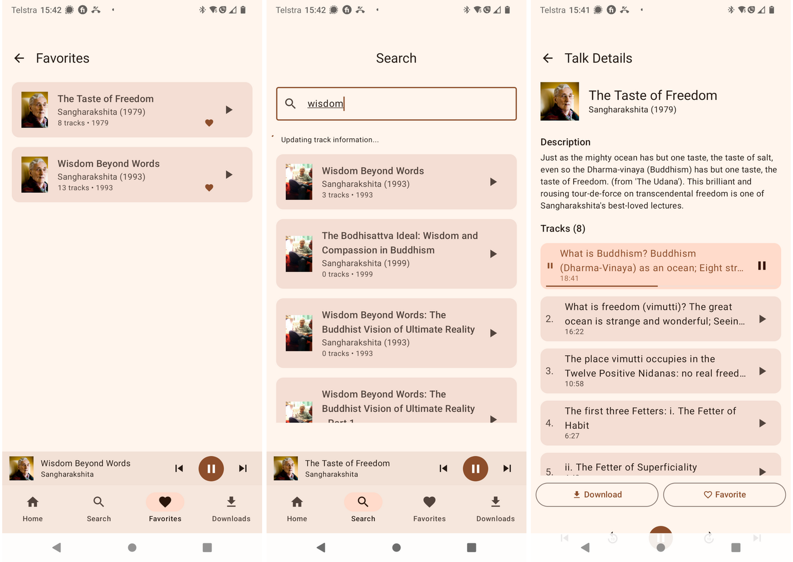
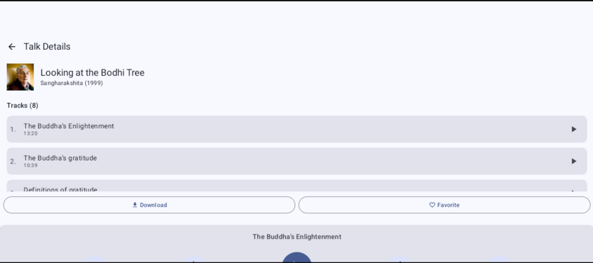

# FreeBuddhistAudio Android app

An Android client for freebuddhistaudio.com.

Current status: 

- Search, download, favourite talks-
- Bluetooth, lock screen, etc works
- Basic android auto (needs work)

TODOs include:

- Nicer home screen with new talks etc
- Better podcast support
- Better Android Auto support

Bugs/enhancements:
- Incorrect talk time display
- Download progress bar not reporting complete progress
- Control placement overlaps Android controls on some devices

